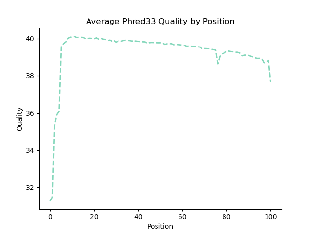
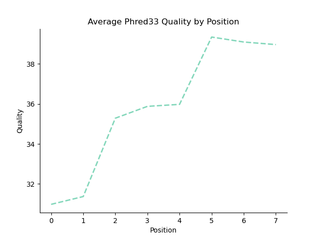
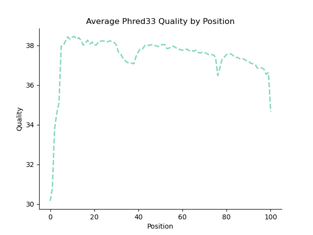

# Demultiplexing P1

Python version: `3.12.4`

Conda environment: `bgmp_demultiplex`

## Data Exploration

The following was done in an interactive node with the following memory specifications
```srun -A bgmp -p bgmp -N 1 -c 4 --mem=100G -t 8:00:00 --pty bash```

**Determined which files are indexes and which are biological reads with:**

```bash
zcat 1294_S1_L008_R1_001.fastq.gz | head -n 4 #biological
zcat 1294_S1_L008_R2_001.fastq.gz | head -n 4 #index
zcat 1294_S1_L008_R3_001.fastq.gz | head -n 4 #index
zcat 1294_S1_L008_R4_001.fastq.gz | head -n 4 #biological
```

**Determined the read lengths in the file:**

I originally planned a much more complex determination for read length in bash:

```bash
zcat 1294_S1_L008_R4_001.fastq.gz | grep "^@K00337" -A 1 | \
grep -vE "^@K00337|--" | awk '{print length}' | sort -n | uniq -c
```

But after speaking with Leslie, I decided only examining one record per file was necessary:

```bash
zcat 1294_S1_L008_R4_001.fastq.gz | head -n 4 | grep "^@K00337" -A 1 | \
grep -vE "^@K00337|--" | awk '{print length}' 

zcat 1294_S1_L008_R1_001.fastq.gz | head -n 4 | grep "^@K00337" -A 1 | \
grep -vE "^@K00337|--" | awk '{print length}' 
```

With this I found all my biological reads have length of 101

```bash
zcat 1294_S1_L008_R2_001.fastq.gz | head -n 4 | grep "^@K00337" -A 1 | \
grep -vE "^@K00337|--" | awk '{print length}' 

zcat 1294_S1_L008_R3_001.fastq.gz | head -n 4 | grep "^@K00337" -A 1 | \
grep -vE "^@K00337|--" | awk '{print length}'
```

And my indexed reads have a length of 8

**Determined phred encoding**

I isolated my qualities with the following. After speaking with Jules, I chose to simply take records from the start of the file, as those would have the lowest scores.

```bash
zcat 1294_S1_L008_R1_001.fastq.gz | head -n 40 | grep "^@K00337" -B 1 | grep -vE "^@K00337|--" > qualities_R1.txt
zcat 1294_S1_L008_R2_001.fastq.gz | head -n 40 | grep "^@K00337" -B 1 | grep -vE "^@K00337|--" > qualities_R2.txt
zcat 1294_S1_L008_R3_001.fastq.gz | head -n 40 | grep "^@K00337" -B 1 | grep -vE "^@K00337|--" > qualities_R3.txt
zcat 1294_S1_L008_R4_001.fastq.gz | head -n 40 | grep "^@K00337" -B 1 | grep -vE "^@K00337|--" > qualities_R4.txt
```

R1 average: `45.02145214521452`

R2 average: `35.203125`

R3 average: `33.44642857142857`

R4 average: `51.603960396039604`

These averages correspond with Phred-33 encoding.

Further heading from these starting records revealed a `+` in the quality line, which converts to a 10 in Phred-33 and is an impossible value in Phred-64 encoding 

I now felt confident moving forward and calculating my per nucleotide distributions

## Per-nucleotide distribution calculations

Full script found in `/projects/bgmp/jujo/bioinfo/PS/Demultiplex/part1.py`

My strategy was to build a one dimensional array the size of the record, iterate through the files creating a running sum of the qualities found at that position. Once you've exited the loop, you can divide each running sum by the number of records to recieve the mean quality at that position shown below:

```bash
q=[sum/line_num for sum in q]
print("read len of ",file_name,len(q))
print(np.mean(q))
```

I wrote these results to a file before creaitng my figures to ensure I could do figure creation multiple times. 

Before setting up by sbatch: I first did a quick test run on 4 small test files and recieved the following results:

```bash
index   mean
0	10.0
1	0.0
2	0.0
3	0.0
4	0.0
5	0.0
6	0.0
7	0.0
8	0.0
9	0.0
10	0.0
11	0.0
12	0.0
13	0.0
14	0.0
15	0.0
16	0.0
```


Examining these results I realized I was grabbing the `+` line NOT the quality line :sob:

After updating my modulous I proceeded with my sbatch script

### SBATCH parameters

I ran my python code in the sbatch script `p1_sbatch.sh` with the following memory specifications and arguments:

```bash
#SBATCH --account=bgmp                    #REQUIRED: which account to use
#SBATCH --partition=bgmp                  #REQUIRED: which partition to use
#SBATCH --cpus-per-task=4                 #optional: number of cpus, default is 1
#SBATCH --mem=16GB                        #optional: amount of memory, default is 4GB per cpu
#SBATCH --job-name=stats                  #optional: job name
python part1.py -f /projects/bgmp/shared/2017_sequencing/1294_S1_L008_R1_001.fastq.gz > R1_means.txt
python part1.py -f /projects/bgmp/shared/2017_sequencing/1294_S1_L008_R2_001.fastq.gz > R2_means.txt
python part1.py -f /projects/bgmp/shared/2017_sequencing/1294_S1_L008_R3_001.fastq.gz > R3_means.txt
python part1.py -f /projects/bgmp/shared/2017_sequencing/1294_S1_L008_R4_001.fastq.gz > R4_means.txt
```

These runs took under 7 hours, though for some reason my `R4_means` was completely empty. Since my other 3 outputs looked correct, I assume I ran out of memory. I tried running my sbatch again with only R_4
 
```bash
/usr/bin/time -v python part1.py -f /projects/bgmp/shared/2017_sequencing/1294_S1_L008_R4_001.fastq.gz > R4_means.txt
```

 I added the timing argument, but after my run completed (text file was populated and there was no jujo lob listed in squeue) in roughly an hour, my `slurmlog` was blank. Given my text files were populated, I proceeded to graphing that night.


The next day, when I discussed this behavior with Leslie we saw that my slurm log populated at 3am (~5 hours after I had created my graphs). 


```bash
    Command being timed: "python part1.py -f /projects/bgmp/shared/2017_sequencing/1294_S1_L008_R4_001.fastq.gz"
    User time (seconds): 21528.45
    System time (seconds): 7.60
    Percent of CPU this job got: 99%
    Elapsed (wall clock) time (h:mm:ss or m:ss): 6:00:54
```

We could not figure out what happened here. But, because my output look normal I was safe to proceed to graph creation.


*Note* this script appended the average q score in the last line, but I removed these for my histograms.


## Per-nucleotide distribution graphing

Full script found in `/projects/bgmp/jujo/bioinfo/PS/Demultiplex/part1_graphs.py`

As these graphs were only graphing 101 values at most, I ran this on the login node.

Same graphing strategy as other assignments, where I read in the .tsv, split on the tab, creating two lists with the information that needs to be graphed. I started out with barplots but thought they looked overly dense. So I switched to a dashed line plot with the following specifications.

```bash
plt.plot(index,means, color="mediumaquamarine",alpha=0.8,linewidth=2,linestyle="--")

#detailed labeling and naming
ax.set(title="Average Phred33 Quality by Position",
       ylabel="Quality",xlabel="Position")
ax.spines['top'].set_visible(False); ax.spines['right'].set_visible(False) 
```

R1



R2



R3


R4



These results matched my peers are were as I expected after listening the Bi622 lectures (quality improving over the read, R2 quality being superior to R3). With this I felt comfortable moving forward with part3.

## Test files for part 3

I created 4 test files each with 3 records inside:

1. The first record should pipe output to the unknown_R1 and unknown_R2 files.
2. The second record should map to the TGTTCCGT_TGTTCCGT_R1 TGTTCCGT_TGTTCCGT_R2
3. The third record should map to the hopped_R1 and hopped_R2 files

**Note:** My part 3 code is functional enough that I can verify that these file placements do occur on 8/1/24. I also tested on 100 record fastq files and it was functional for that as well.

# END OF LAB NOTEBOOK FOR PART 1, GRADERS READ NO FURTHER :skull:

# Part 2:

I brainstormed my approach for this in `Assignment-the-first/Answers.md`:

# Part 3:

After recieving my Part 2 feedback and reading other's code I changed the following:

1. When I read Claire's pseudocode, I realized I handled quality checking way too early which complicated things.
    1. I changed my logic to creating my records BEFORE verifying any barocde quality
2. For writing to my files I initally did the following

    ```bash
    try:
        open(file,"a")
    except:
        open(file, "w")
    ```

    1. After listening to Leslie's lecture, I realized though not as slow as constantly writing, this would take an estimated 42 hours!
    2. I created the functions.
3. Created my reverse compliment function `reverse_compliment`
4. Deleted my  `determine_output_file` as I realized my if statements served the same purpose.
5. Updated my `format_fastq` to add information I was previously missing in my headers.
6. Had planned sliding qualities but while in the testing phase I kept my quality threshold to a global 30.
7. Changed my naming so all hopped and unknown barcodes are grouped in two files.

To create my second test files 100 sequences:
```bash
(base) (base) [jujo@n0349 Demultiplex]$ zcat /projects/bgmp/shared/2017_sequencing/1294_S1_L008_R1_001.fastq.gz | head -n 400000 | tail -n 400 > r1_mid_test.fq
(base) (base) [jujo@n0349 Demultiplex]$ zcat /projects/bgmp/shared/2017_sequencing/1294_S1_L008_R2_001.fastq.gz | head -n 40
0000 | tail -n 400 > r2_mid_test.fq
(base) (base) [jujo@n0349 Demultiplex]$ zcat /projects/bgmp/shared/2017_sequencing/1294_S1_L008_R3_001.fastq.gz | head -n 40
0000 | tail -n 400 > r3_mid_test.fq
(base) (base) [jujo@n0349 Demultiplex]$ zcat /projects/bgmp/shared/2017_sequencing/1294_S1_L008_R4_001.fastq.gz | head -n 40
0000 | tail -n 400 > r4_mid_test.fq
```

To create my first test file 2 sequences (both to unknown):

```bash
(base) (base) [jujo@n0349 Demultiplex]$ zcat /projects/bgmp/shared/2017_sequencing/1294_S1_L008_R1_001.fastq.gz | head -n 8 > r1_test.fq
(base) (base) [jujo@n0349 Demultiplex]$ zcat /projects/bgmp/shared/2017_sequencing/1294_S1_L008_R2_001.fastq.gz | head -n 8 > r2_test.fq
(base) (base) [jujo@n0349 Demultiplex]$ zcat /projects/bgmp/shared/2017_sequencing/1294_S1_L008_R3_001.fastq.gz | head -n 8  > r3_test.fq
(base) (base) [jujo@n0349 Demultiplex]$ zcat /projects/bgmp/shared/2017_sequencing/1294_S1_L008_R4_001.fastq.gz | head -n 8 > r4_test.fq
```

made my index verification a set because I was opening the file for every record

- this made my code x2 as fast as my original implementation

made my file opening use the index as well 

had weird erorr where i had to strip my quality lines because a newline is -23 phred!

realized that my barcode check fails to do a simple toss out if an N exists

simplified my keys for the my file handle barcode

started extended statistics

added arg parse

