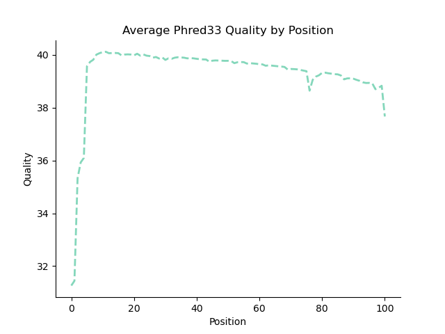
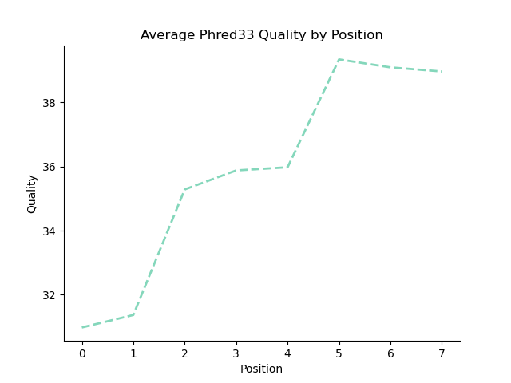
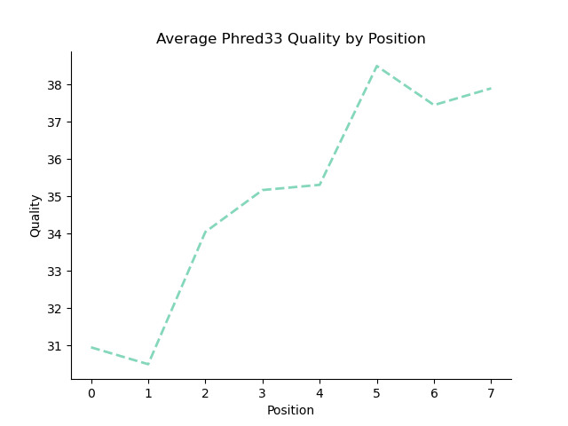
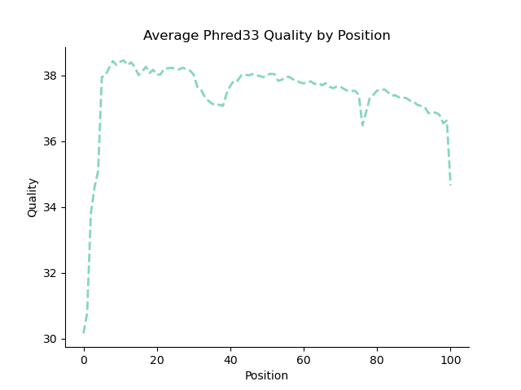
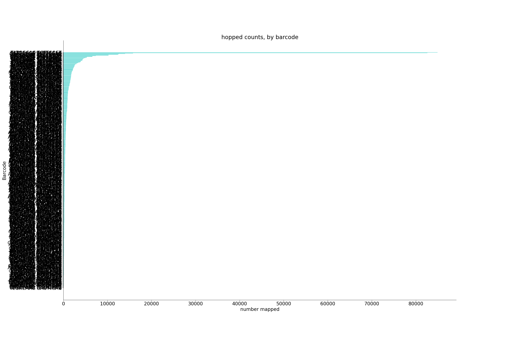
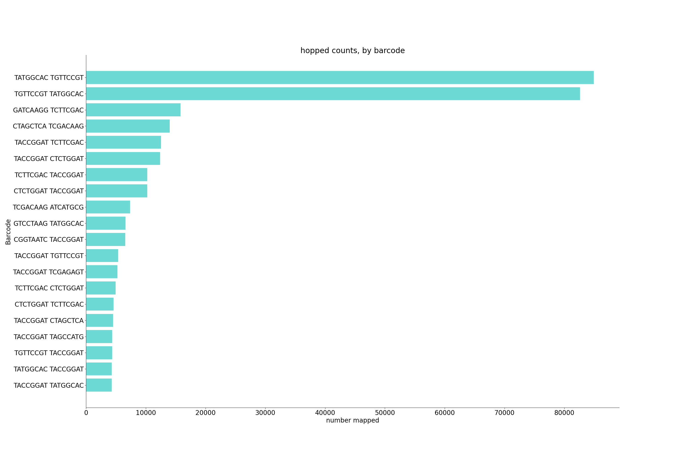
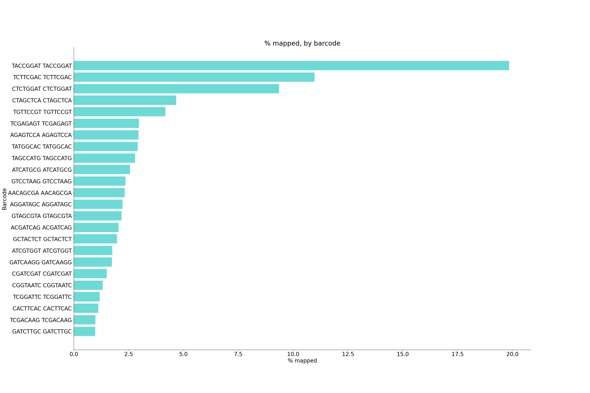

# Demultiplexing P1

Python version: `3.12.4`

Conda environment: `bgmp_demultiplex`

## Data Exploration

The following was done in an interactive node with the following memory specifications
```srun -A bgmp -p bgmp -N 1 -c 4 --mem=100G -t 8:00:00 --pty bash```

**Determined which files are indexes and which are biological reads with:**

```bash
zcat 1294_S1_L008_R1_001.fastq.gz | head -n 4 #biological
zcat 1294_S1_L008_R2_001.fastq.gz | head -n 4 #index
zcat 1294_S1_L008_R3_001.fastq.gz | head -n 4 #index
zcat 1294_S1_L008_R4_001.fastq.gz | head -n 4 #biological
```

**Determined the read lengths in the file:**

I originally planned a much more complex determination for read length in bash:

```bash
zcat 1294_S1_L008_R4_001.fastq.gz | grep "^@K00337" -A 1 | \
grep -vE "^@K00337|--" | awk '{print length}' | sort -n | uniq -c
```

But after speaking with Leslie, I decided only examining one record per file was necessary:

```bash
zcat 1294_S1_L008_R4_001.fastq.gz | head -n 4 | grep "^@K00337" -A 1 | \
grep -vE "^@K00337|--" | awk '{print length}' 

zcat 1294_S1_L008_R1_001.fastq.gz | head -n 4 | grep "^@K00337" -A 1 | \
grep -vE "^@K00337|--" | awk '{print length}' 
```

With this I found all my biological reads have length of 101

```bash
zcat 1294_S1_L008_R2_001.fastq.gz | head -n 4 | grep "^@K00337" -A 1 | \
grep -vE "^@K00337|--" | awk '{print length}' 

zcat 1294_S1_L008_R3_001.fastq.gz | head -n 4 | grep "^@K00337" -A 1 | \
grep -vE "^@K00337|--" | awk '{print length}'
```

And my indexed reads have a length of 8

**Determined phred encoding**

I isolated my qualities with the following. After speaking with Jules, I chose to simply take records from the start of the file, as those would have the lowest scores.

```bash
zcat 1294_S1_L008_R1_001.fastq.gz | head -n 40 | grep "^@K00337" -B 1 | grep -vE "^@K00337|--" > qualities_R1.txt
zcat 1294_S1_L008_R2_001.fastq.gz | head -n 40 | grep "^@K00337" -B 1 | grep -vE "^@K00337|--" > qualities_R2.txt
zcat 1294_S1_L008_R3_001.fastq.gz | head -n 40 | grep "^@K00337" -B 1 | grep -vE "^@K00337|--" > qualities_R3.txt
zcat 1294_S1_L008_R4_001.fastq.gz | head -n 40 | grep "^@K00337" -B 1 | grep -vE "^@K00337|--" > qualities_R4.txt
```

R1 average: `45.02145214521452`

R2 average: `35.203125`

R3 average: `33.44642857142857`

R4 average: `51.603960396039604`

These averages correspond with Phred-33 encoding.

Further heading from these starting records revealed a `+` in the quality line, which converts to a 10 in Phred-33 and is an impossible value in Phred-64 encoding 

I now felt confident moving forward and calculating my per nucleotide distributions

## Per-nucleotide distribution calculations

Full script found in `/projects/bgmp/jujo/bioinfo/PS/Demultiplex/part1.py`

My strategy was to build a one dimensional array the size of the record, iterate through the files creating a running sum of the qualities found at that position. Once you've exited the loop, you can divide each running sum by the number of records to recieve the mean quality at that position shown below:

```bash
q=[sum/line_num for sum in q]
print("read len of ",file_name,len(q))
print(np.mean(q))
```

I wrote these results to a file before creaitng my figures to ensure I could do figure creation multiple times. 

Before setting up by sbatch: I first did a quick test run on 4 small test files and recieved the following results:

```bash
index   mean
0	10.0
1	0.0
2	0.0
3	0.0
4	0.0
5	0.0
6	0.0
7	0.0
8	0.0
9	0.0
10	0.0
11	0.0
12	0.0
13	0.0
14	0.0
15	0.0
16	0.0
```


Examining these results I realized I was grabbing the `+` line NOT the quality line :sob:

After updating my modulous I proceeded with my sbatch script

### SBATCH parameters

I ran my python code in the sbatch script `p1_sbatch.sh` with the following memory specifications and arguments:

```bash
#SBATCH --account=bgmp                    #REQUIRED: which account to use
#SBATCH --partition=bgmp                  #REQUIRED: which partition to use
#SBATCH --cpus-per-task=4                 #optional: number of cpus, default is 1
#SBATCH --mem=16GB                        #optional: amount of memory, default is 4GB per cpu
#SBATCH --job-name=stats                  #optional: job name
python part1.py -f /projects/bgmp/shared/2017_sequencing/1294_S1_L008_R1_001.fastq.gz > R1_means.txt
python part1.py -f /projects/bgmp/shared/2017_sequencing/1294_S1_L008_R2_001.fastq.gz > R2_means.txt
python part1.py -f /projects/bgmp/shared/2017_sequencing/1294_S1_L008_R3_001.fastq.gz > R3_means.txt
python part1.py -f /projects/bgmp/shared/2017_sequencing/1294_S1_L008_R4_001.fastq.gz > R4_means.txt
```

These runs took under 7 hours, though for some reason my `R4_means` was completely empty. Since my other 3 outputs looked correct, I assume I ran out of memory. I tried running my sbatch again with only R_4
 
```bash
/usr/bin/time -v python part1.py -f /projects/bgmp/shared/2017_sequencing/1294_S1_L008_R4_001.fastq.gz > R4_means.txt
```

 I added the timing argument, but after my run completed (text file was populated and there was no jujo lob listed in squeue) in roughly an hour, my `slurmlog` was blank. Given my text files were populated, I proceeded to graphing that night.


The next day, when I discussed this behavior with Leslie we saw that my slurm log populated at 3am (~5 hours after I had created my graphs). 


```bash
    Command being timed: "python part1.py -f /projects/bgmp/shared/2017_sequencing/1294_S1_L008_R4_001.fastq.gz"
    User time (seconds): 21528.45
    System time (seconds): 7.60
    Percent of CPU this job got: 99%
    Elapsed (wall clock) time (h:mm:ss or m:ss): 6:00:54
```

We could not figure out what happened here. But, because my output look normal I was safe to proceed to graph creation.


*Note* this script appended the average q score in the last line, but I removed these for my histograms.


## Per-nucleotide distribution graphing

Full script found in `/projects/bgmp/jujo/bioinfo/PS/Demultiplex/part1_graphs.py`

As these graphs were only graphing 101 values at most, I ran this on the login node.

Same graphing strategy as other assignments, where I read in the .tsv, split on the tab, creating two lists with the information that needs to be graphed. I started out with barplots but thought they looked overly dense. So I switched to a dashed line plot with the following specifications.

```bash
plt.plot(index,means, color="mediumaquamarine",alpha=0.8,linewidth=2,linestyle="--")

#detailed labeling and naming
ax.set(title="Average Phred33 Quality by Position",
       ylabel="Quality",xlabel="Position")
ax.spines['top'].set_visible(False); ax.spines['right'].set_visible(False) 
```

R1



R2



R3



R4



These results matched my peers are were as I expected after listening the Bi622 lectures (quality improving over the read, R2 quality being superior to R3). With this I felt comfortable moving forward with part3.

## Test files for part 3

I created 4 test files each with 3 records inside:

1. The first record should pipe output to the unknown_R1 and unknown_R2 files.
2. The second record should map to the TGTTCCGT_TGTTCCGT_R1 TGTTCCGT_TGTTCCGT_R2
3. The third record should map to the hopped_R1 and hopped_R2 files

**Note:** My part 3 code is functional enough that I can verify that these file placements do occur on 8/1/24. I also tested on 100 record fastq files and it was functional for that as well.

# END OF LAB NOTEBOOK FOR PART 1, GRADERS READ NO FURTHER :skull:

# Part 2:

I brainstormed my approach for this in `Assignment-the-first/Answers.md`:

# Part 3:

## :boom:Revelations:boom: from peer-reviews
After recieving my Part 2 feedback and reading other's code I changed the following:

1. When I read Claire's pseudocode, I realized I handled quality checking way too early which complicated things.
    1. I changed my logic to creating my records BEFORE verifying any barocde quality:

    

2. For writing to my output files I initally did the following

    ```bash
    try:
        open(file,"a")
    except:
        open(file, "w")
    ```

    1. After listening to Leslie's lecture, I realized though not as slow as constantly writing (82 hours), this would take an estimated 42 hours!
        1. Brainstormed the best solution was to save all of my open output files handles into a dictionary where the key is the case in which I would use this. 
    2. I created some new functions.
        1. Created my reverse compliment function `reverse_compliment`
        2. Deleted my  `determine_output_file` as I realized my if statements served the same purpose.
        3. Updated my `format_fastq` to add information I was previously missing in my headers.
        4. Had planned sliding qualities but while in the testing phase I kept my quality threshold to a global 26.
        5. Changed my naming so all hopped and unknown barcodes are grouped in two files.

Since I wrote my pseudocode very code-like, after the above revelations I filled in my pseudocode functions and was ready to test my code.

## Creating test files

For my first test file I wanted to make sure all of my functions worked on a very simple case: everything going to unknown

Created by the command:

```bash
(bgmp_demultiplex) [jujo@n0349 Demultiplex]$ zcat /projects/bgmp/shared/2017_sequencing/1294_S1_L008_R1_001.fastq.gz | head -n 8 > r1_test.fq
(bgmp_demultiplex)[jujo@n0349 Demultiplex]$ zcat /projects/bgmp/shared/2017_sequencing/1294_S1_L008_R2_001.fastq.gz | head -n 8 > r2_test.fq
(bgmp_demultiplex)[jujo@n0349 Demultiplex]$ zcat /projects/bgmp/shared/2017_sequencing/1294_S1_L008_R3_001.fastq.gz | head -n 8  > r3_test.fq
(bgmp_demultiplex)[jujo@n0349 Demultiplex]$ zcat /projects/bgmp/shared/2017_sequencing/1294_S1_L008_R4_001.fastq.gz | head -n 8 > r4_test.fq
```

**Note:** I later changed these files to what I turned in for part1, once I thought my code was ready to handle all cases

To create my second test files 100 sequences:

```bash
(bgmp_demultiplex)[jujo@n0349 Demultiplex]$ zcat /projects/bgmp/shared/2017_sequencing/1294_S1_L008_R1_001.fastq.gz | head -n 400000 | tail -n 400 > r1_mid_test.fq
(bgmp_demultiplex) [jujo@n0349 Demultiplex]$ zcat /projects/bgmp/shared/2017_sequencing/1294_S1_L008_R2_001.fastq.gz | head -n 40
0000 | tail -n 400 > r2_mid_test.fq
(bgmp_demultiplex) [jujo@n0349 Demultiplex]$ zcat /projects/bgmp/shared/2017_sequencing/1294_S1_L008_R3_001.fastq.gz | head -n 40
0000 | tail -n 400 > r3_mid_test.fq
(bgmp_demultiplex) [jujo@n0349 Demultiplex]$ zcat /projects/bgmp/shared/2017_sequencing/1294_S1_L008_R4_001.fastq.gz | head -n 40
0000 | tail -n 400 > r4_mid_test.fq
```

At this point, my code successfully wrote to the proper files on smaller test files, but I knew it would be too slow to run on the main file. Thus I began working on some optimizations.

## Optimizations

*I worked with Claire, Jules, Varsheni, and Kenny to help them get their part 3 code started, while working with them numerous optimizations were made*

### Still opening a file 353 million times :skull:

When examining my functions, I realized that my `search_for_index_match` was a huge bottleneck for my code.

```bash
def search_for_index_match(index):
    """check to see if index is in our known list of indices
    """
    for item in open("index.txt"):
        if item.split()[-1]==index:
            return True
        
    return False
```

This code opens `index.txt` every time and in the worst case has to run through the entire file.

After speaking with Varsheni, I decided to run through `index.txt` once, building a set of all possible barcodes (see `x` for the full implementation). I could then just check that set within `search_for_index_match`, making that function one line

```bash
    return (index in VALID_INDICES_SET)
```

- Even on my small test files, this made my code **twice** as fast as my original implementation

### micro-optimization: file dictionary creation

- made my file opening use the index as well 

### introducing new functions causing errors :sob:

- had weird erorr where i had to strip my quality lines because a newline is -23 phred!

### micro-optimization: key simplification

- simplified my keys for the my file handle barcode

### Extended statistics: itertools

- Decided to add my extended statistics.
- Talapas froze when I did not specify permutation 2 to be two.
- Ended up changing my final logic to:

```bash
#all hopped barcodes
l=list(itertools.permutations(list(VALID_INDICES_SET),2))
#all matched barcodes
for item in VALID_INDICES_SET:
    l.append((item,item))
#all idk barcodes
l.append("unk")
#set default value to zero 
return {key: 0 for key in l}
```

### Arg parse

- Added arg parse to read in my input files.

## Napkin math

To ensure my code was reasonable enough to run:

Timed how long one record takes (to be able to estimate constant operations): `0.05` seconds

Timed how long 100 records takes: `0.05` seconds again:question: Decided to increase test file size to 1,000 records.

Timed how long 1000 records takes: `0.08` seconds

- Removing constant operations: `0.08-0.05 = 0.03`

We have 343,246,753 records aka 343,246.753 1,000 record segments. Timing-wise this equates to `343246.753(0.03)=10297.40259 seconds`

- Converting this to hours: 10297.40259 seconds :arrow_right: 171.62 minutes :arrow_right: 2.8 hours.

I felt 2.8 hours was quick enough to proceed and created my sbatch script

- I tried running my script for 1 min outside of sbatch to see if anything happened, no errors so I proceeded.

## Actual run

Actual run was two times faster than predicted :heart:

```bash
Command being timed: \
"python part3.py\
-r1 /projects/bgmp/shared/2017_sequencing/1294_S1_L008_R1_001.fastq.gz \
-r2 /projects/bgmp/shared/2017_sequencing/1294_S1_L008_R2_001.fastq.gz\
-r3 /projects/bgmp/shared/2017_sequencing/1294_S1_L008_R3_001.fastq.gz \
-r4 /projects/bgmp/shared/2017_sequencing/1294_S1_L008_R4_001.fastq.gz"
User time (seconds): 4147.22
System time (seconds): 93.83
Percent of CPU this job got: 88%
Elapsed (wall clock) time (h:mm:ss or m:ss): 1:19:59
Maximum resident set size (kbytes): 251980
Exit status: 0
```

This run was much quicker than I expected, and my statisitics file looked correct when I skimmed it over

```bash 
Total Number of Records: 363246735

Record breakdown by category:
Unknown Records: 12.9300% 
Hopped Records: 0.1680% 
Matched Records: 86.9021% 

Detailed record breakdown:
TACCGGAT TACCGGAT records: 19.85% 
```

After speaking with Leslie, I decided to add raw counts besides the percentages and some plots. My plots were as follows:

- One plot to show the **percentage** of each valid barcode pair that mapped (e.g., TACCGGAT-TACCGGAT=20%)

- One plot to show the **raw counts** of the **top twenty** hopped barcode combinations.

Because I did not save my raw counts, I had to run my sbatch script again:

```bash
Command being timed: "python part3.py 
-r1 /projects/bgmp/shared/2017_sequencing/1294_S1_L008_R1_001.fastq.gz \
-r2 /projects/bgmp/shared/2017_sequencing/1294_S1_L008_R2_001.fastq.gz \
-r3 /projects/bgmp/shared/2017_sequencing/1294_S1_L008_R3_001.fastq.gz \
-r4 /projects/bgmp/shared/2017_sequencing/1294_S1_L008_R4_001.fastq.gz"
User time (seconds): 4039.71
System time (seconds): 111.93
Percent of CPU this job got: 87%
Elapsed (wall clock) time (h:mm:ss or m:ss): 1:19:04
Maximum resident set size (kbytes): 298816
Exit status: 0
```

### Missed hopped reads

My graphing worked as intended for my matched reads but I finally noticed that though the general stats were correct (% matched, % hopped, % unknown) my percentage breakdowns for hopped barcodes were all at 0.0%.

- Initially, I thought that I truncated had an issue with truncation but I eventually realized my error was very dumb

```  bash
        stats_info[(sequence_info["i1"],sequence_info["i2"])]
```

I never incremented hopped barcodes when I encountered them :x:

**Note** While troubleshooting this, I spoke with Shayal and realized that my header dictionary didn't need i1 and i2, so I removed those.

## Actual run again :)

Because I did not actually get my hopped barcode counts, I needed to run this code AGAIN. Thankfully this was my fastest run yet.

```bash
Command being timed: "python part3.py \
-r1 /projects/bgmp/shared/2017_sequencing/1294_S1_L008_R1_001.fastq.gz \
-r2 /projects/bgmp/shared/2017_sequencing/1294_S1_L008_R2_001.fastq.gz \
-r3 /projects/bgmp/shared/2017_sequencing/1294_S1_L008_R3_001.fastq.gz \
-r4 /projects/bgmp/shared/2017_sequencing/1294_S1_L008_R4_001.fastq.gz"
User time (seconds): 3183.09
System time (seconds): 46.35
Percent of CPU this job got: 88%
Elapsed (wall clock) time (h:mm:ss or m:ss): 1:00:43
Maximum resident set size (kbytes): 307632
Exit status: 0
```

My hopped barcodes were now counted in my extended stats text file BUT my graph was unreadable :sob:




Thankfully this was an easy fix and I only had to rerun the graphing code. I changed my results to only graph the top 20 hopped barcodes. I also switched from using append to insert so I am not wasting time reversing my data in my graphing call. 

### Final output for real

#### Hopped counts by barcode pair



- TGTTCCGT both involved in the top two hopped barcode combinations
- Sharp decrease in frequencies after the first two hopped barcodes

#### % mapped by barcode pair



- TACCGGAT is by far the most common barcode pair.
- Sharp decrease adter the top three matched barcodes.

#### Extended stats snippet

See full output at `Assignment-the-third/results/extended_stats.txt`

```bash
Total Number of Records: 363246735

Record breakdown by category:
Unknown Records: 12.9300% (46967706)
Hopped Records: 0.1680% (610138)
Matched Records: 86.9021% (315668891)

Detailed record breakdown:
TACCGGAT TACCGGAT records: 19.85% (72116897)
Unknown records: 12.93% (46967706)
TCTTCGAC TCTTCGAC records: 10.97% (39850432)
```

## Final results interpretation

- Hopping is **very** uncommon.
- Certain barcodes are heavily favored over others even in matched pairs.
- The most common hopped pairs consist of the most common mapped barcodes (makes sense as there are more of them around, leading to a higher risk of error).